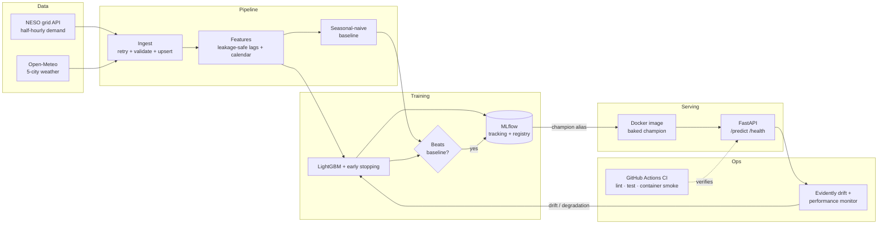

# UK Grid Demand Forecasting — End-to-End MLOps


**🔴 Live API (Google Cloud Run):** https://grid-demand-api-359251346586.europe-west2.run.app/docs
&nbsp;·&nbsp; try `/health` for status, `/docs` for the interactive UI.
*(Scales to zero, so the first request after idle takes ~10–15s to wake.)*

A production-style machine learning system that forecasts UK national electricity
demand (half-hourly, day-ahead) and keeps itself healthy: it ingests live grid and
weather data, trains a gradient-boosted model behind a baseline-beating quality gate,
serves it through a containerized API, verifies every change in CI, and retrains
itself when the incoming data drifts.

**Headline result:** cuts day-ahead forecast error **38% vs the seasonal-naive
baseline** (7.8% → **4.9% MAPE**, ~1,200 MW MAE) on an 11-month chronological
holdout, trained on **4.5 years** of half-hourly data (79k+ records).

---

## Architecture



## Tech stack

| Layer | Tools |
|---|---|
| Data & features | Python, pandas, pyarrow, requests |
| Model | LightGBM (gradient boosting) |
| Experiment tracking & registry | MLflow (SQLite backend) |
| Serving | FastAPI, Pydantic, Uvicorn |
| Packaging | Docker (layer-cached, non-root, healthcheck) |
| CI/CD | GitHub Actions (lint → test → build → container smoke test) |
| Deployment | Google Cloud Run (serverless, scale-to-zero) |
| Monitoring | Evidently (data drift + performance degradation) |
| Quality | pytest (43 tests, fully offline), ruff |

## Key engineering decisions

- **Beat the baseline or don't ship.** The model is only registered as `champion`
  if it beats a seasonal-naive forecast on the same test window — automated quality
  control, not vibes.
- **Leakage-safe features.** Every lag is ≥ 48 half-hourly periods; rolling stats are
  shifted past the horizon before windowing; features are computed on a complete time
  grid so lags stay correct across data gaps. A dedicated test suite pins this down.
- **Everything UTC, DST-aware.** UK settlement periods count from *local* midnight, so
  clock-change days have 46 or 50 periods. Calendar features use local wall-clock time.
- **Train/serve decoupling.** The API loads `models:/griddemand-lgbm@champion` by alias;
  deploying a new model is a retrain, not a redeploy. Rollback is a one-line alias change.
- **Immutable deployment artifact.** The champion is baked into the Docker image, so
  "which model is in prod?" is answered by the image tag.
- **Idempotent, resilient ingestion.** Retries with backoff, physical-plausibility
  validation, metadata-driven resource discovery, timestamp upserts safe to re-run.

## Results

| Model | MAPE | MAE (MW) | Test window |
|---|---|---|---|
| Seasonal-naive (daily) | 7.83% | 1,995 | 11 months, chronological holdout |
| **LightGBM champion** | **4.89%** | **1,205** | same |

## Quickstart

```bash
python3.12 -m venv .venv && source .venv/bin/activate
pip install -e ".[dev]"
pytest -q                                             # 43 tests, offline

python scripts/backfill.py --years 2022 2023 2024 2025 2026
python scripts/build_features.py
python scripts/train.py                               # logs to MLflow, gates, promotes

python scripts/export_model.py
docker build -t grid-demand-api .
docker run -p 8000:8000 grid-demand-api
curl localhost:8000/health
```

Interactive API docs at `http://localhost:8000/docs`. Experiment history:
`mlflow ui --backend-store-uri sqlite:///mlflow.db`.

## Operations

```bash
python scripts/ingest.py --days 90     # daily incremental pull
python scripts/monitor.py              # drift + performance report; retrain verdict
python scripts/monitor.py --retrain    # act on the verdict
```

## Project layout

```
src/griddemand/
├── config.py            # central config, env-overridable
├── http.py              # retry/backoff/timeout wrapper
├── ingest/              # NESO demand + Open-Meteo weather, upserts
├── features/            # leakage-safe feature engineering
├── models/              # training, MLflow registry, baseline
├── serving/             # FastAPI app + Pydantic schemas
└── monitoring/          # Evidently drift + retrain decision
scripts/                 # thin CLI entry points
tests/                   # 43 offline, fixture-based tests
.github/workflows/ci.yml # lint · test · docker build · container smoke test
Dockerfile
```

## Data sources (free, keyless)

- **NESO Historic + Daily Demand Data** — half-hourly national demand (ND/TSD)
- **Open-Meteo** — hourly weather for 5 UK metros, population-weighted to a national series

---

*Built as a hands-on study of production ML engineering: MLOps, containerization,
CI/CD, cloud deployment, and model monitoring.*